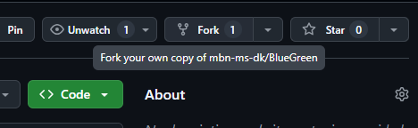
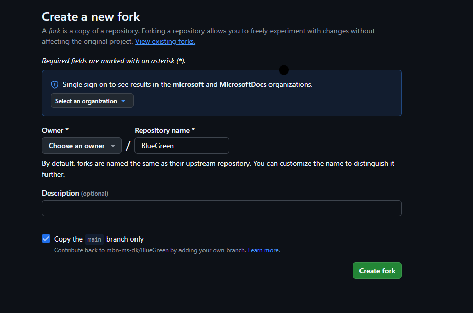
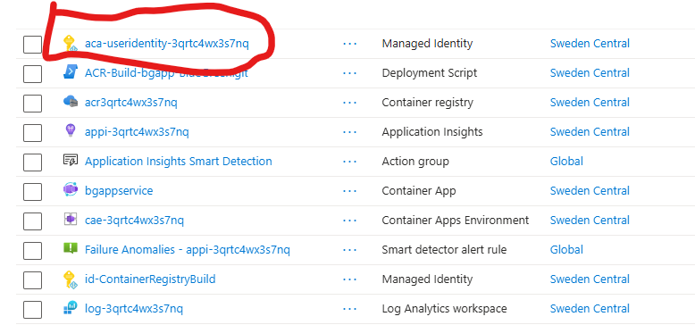
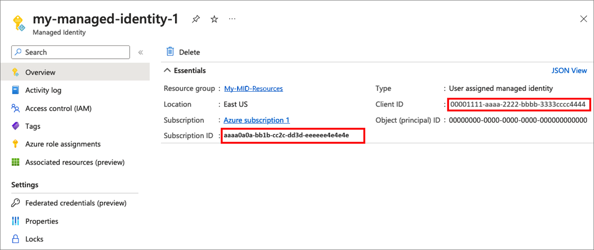
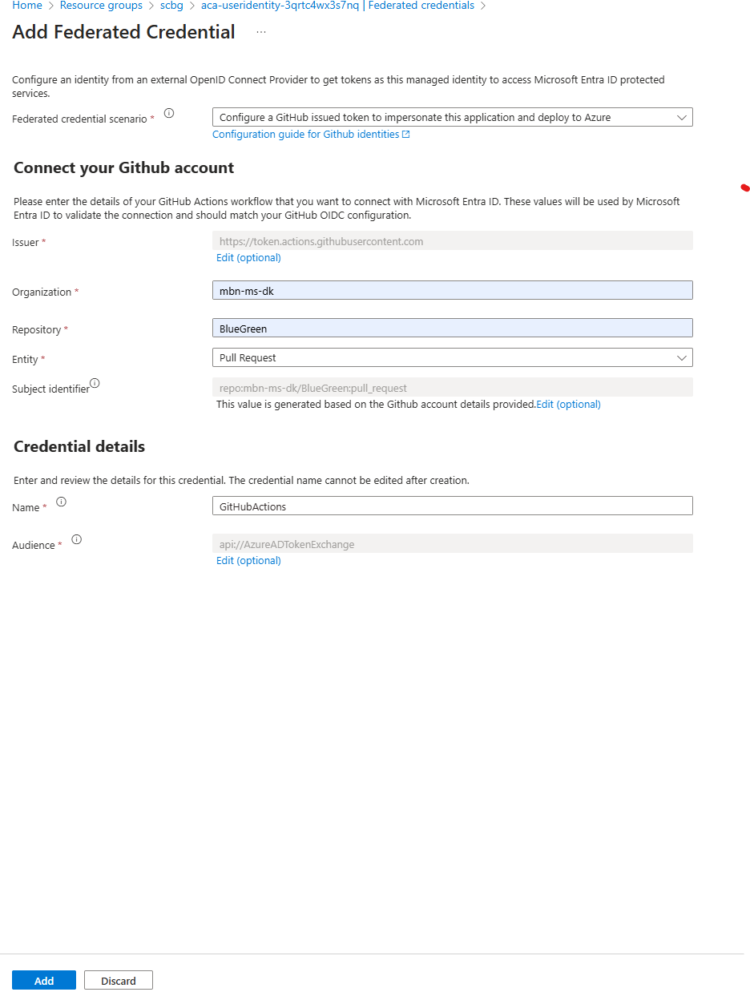

# BlueGreen

[](https://github.com/mbn-ms-dk/BlueGreen/actions/workflows/bluegreen.yml)

[](https://github.com/mbn-ms-dk/BlueGreen/actions/workflows/codeql.yml)

[Blue-Green Deployment](https://martinfowler.com/bliki/BlueGreenDeployment.html) is a software release strategy that aims to minimize downtime and reduce the risk associated with deploying new versions of an application. In a blue-green deployment, two identical environments, referred to as "blue" and "green," are set up. One environment (blue) is running the current application version and one environment (green) is running the new application version.

Once the  green environment is tested, the live traffic is directed to it, and the blue environment is used to deploy a new application version during next deployment cycle.

| Revision | Description |
| -------- | -------- |
| **Blue** revision | The revision labeled as blue is the currently running and stable version of the application. This revision is the one that users interact with, and it's the target of production traffic. |
| **Green** revision | The revision labeled as green is a copy of the blue revision except it uses a newer version of the app code and possibly new set of environment variables. It doesn't receive any production traffic initially but is accessible via a labeled fully qualified domain name (FQDN). |

After you test and verify the new revision, you can then point production traffic to the new revision. If you encounter issues, you can easily roll back to the previous version.

| Actions | Description |
| -------- | -------- |
| Testing and verification | The **green** revision is thoroughly tested and verified to ensure that the new version of the application functions as expected. This testing might involve various tasks, including functional tests, performance tests, and compatibility checks. |
| Traffic switch | Once the **green** revision is tested and verified, you can switch the traffic from the **blue** revision to the **green** revision. |
| Rollback | If you encounter issues with the **green** revision, you can easily roll back to the **blue** revision. |
| Role Change | The roles of the **blue** and **green** revisions change after a successful deployment to the **green** revision. During the next release cycle, the **green** revision represents the stable production environment while the new version of the application code is deployed and tested in the **blue** revision. |

The code snippets demonstrate the process of setting up a Blue-Green deployment using Azure ContainerApps and GitHub Actions. Make sure to follow the instructions carefully and set the required secrets and environment variables in your GitHub repository. Once everything is set up, you can make changes to the sample app, create a pull request, and merge it to the main branch to trigger the deployment process.

## AzureDevOps Repo
The equivalent replica of this repo in AzureDevops can be found [here](https://dev.azure.com/kamimanzoor/azure-container-apps/_git/BlueGreen)

## Fork the repository

Fork the repository to your GitHub account.



Set your own GitHub handle as the owner:



Now you will have the repository locally on your machine.

Open the local folder on your machine in Visual Studio Code.

## Create environment

Create a resource group for the environment. The following will create a new resource group in the `swedencentral` region.

```bash
az group create --name <name-of-resource-group> --location swedencentral
```

Then use the following to create a new Azure ContainerApps environment as well as a new Azure Container Registry. It will also deploy an initial version of the sample app to the environment.

```bash
az deployment group create --resource-group <name-of-resource-group> --template-file ".\infrastructure\bicep\deploy-infra.bicep"
```

## Github actions environment variables (from add infra)

The values from the `az deployment group create` command can be retrieved from the Azure portal or CLI and added.

To set environment variables in GitHub, go to your repository, click on `Settings`, then `Secrets and variables`, and finally `Actions`. Select `Variables` and click on `New repository variable`.
Add the following environment variables to your GitHub repository:

* `AZURE_ENVIRONMENT_NAME` - the short name of the existing Azure Container Apps environment where the sample app will be deployed to, for example `mycontainerappenv`. Do not use the full environment ARM resource id. You can use this command to get it:

```bash
az containerapp env list -g <name-of-resource-group> --query [].name
```

* `AZURE_ACR_NAME` - the short name of the existing Azure Container Registry where the sample app will be deployed from, for example `mycontainerregistry`. Do not use the full registry ARM resource id. You can use this command to get it:

```bash
az acr list -g <name-of-resource-group> --query [].name
```

* `AZURE_RG` - the name of the existing Azure resource group where the sample app will be deployed to.
* `AZURE_APP_NAME` - the name of the containerapp where the sample app will be deployed to. You can use this command to get it:

```bash
az containerapp list -g <name-of-resource-group> --query [].name
```

* `AZURE_APP_DNSSUFFIX` - the default domain of the containerapp environment where the sample app will be deployed to, for example `whitedesert-078f44c6.<region>.azurecontainerapps.io`. You can use this command to get it:

```bash
az containerapp env show -g <name-of-resource-group> -n <name-of-containerapps-environment> --query properties.defaultDomain
```

## Configuring OpenID Connect in Azure

[OpenID Connect in Azure](https://docs.github.com/en/actions/security-for-github-actions/security-hardening-your-deployments/configuring-openid-connect-in-azure)
OpenID Connect (OIDC) allows your GitHub Actions workflows to access resources in Azure, without needing to store the Azure credentials as long-lived GitHub secrets. This is achieved by using a short-lived token that is generated by Azure when the workflow runs.

For this setup, we will use a user-assigned managed identity to authenticate the GitHub Actions workflow with Azure. The managed identity will be granted the required permissions to access the Azure resources.

After the bidep deployment is done, there will be a user-assigned managed identity created in the resource group. You can find it in the Azure portal under `Resource groups` > `<name-of-resource-group>` > `Identity`.


Click on the managed identity and copy the `Client ID` and the `Subscription ID`. You will need these values to set up the GitHub secrets.

Use the following values as GitHub secrets from your Microsoft Entra managed identity for your GitHub workflow. To set GitHub secrets, go to your repository, click on `Settings`, then `Secrets and variables`, and finally `Actions`. Select `New repository secret`.

`AZURE_CLIENT_ID` the managed identity Client ID.

`AZURE_SUBSCRIPTION_ID` the Subscription ID.

`AZURE_TENANT_ID` the Tenant ID.

The following screenshot demonstrates how to copy the managed identity ID and subscription ID.



AZURE_TENANT_ID the Directory (tenant) ID. [Learn how to find your Microsoft Entra tenant ID.](https://learn.microsoft.com/en-us/azure/active-directory-b2c/tenant-management-read-tenant-name)

## Set federated credentials

To allow GitHub Actions to use the managed identity, you need to set up federated credentials. This allows GitHub Actions to authenticate with Azure using the managed identity.

1. Go to the Azure portal and navigate to the managed identity you created earlier.
2. Under `Settings`, select `Federated credentials`.
3. Click on `Add` to create a new federated credential.
4. In the `Add federated credential` pane, select `GitHub Actions` as the identity provider.
5. In the `Repository` field, enter the name of your GitHub repository in the format `<owner>/<repo>`, for example `mbn-ms-dk/BlueGreen`.
6. In the `Entity`field, select `Pull request` as the entity type.
7. Provide a name for the federated credential, for example `GitHubActions`.
8. Click on `Add` to create the federated credential.



## Permissions

Give the managed identity the following permissions:
owner role on the resource group where the Azure Container Apps environment is deployed.

Open the Azure portal and navigate to the resource group where the Azure Container Apps environment is deployed.

1. Under `Overview`, select `Access control (IAM)`.
2. Click on `Add role assignment`.
3. In the `Privileged administrator roles` field, select `Owner`.
4. In the `Assign access to` field, select `Managed Identity`.
5. In the `Select` field, search for the managed identity you created earlier and select it.
6. Click on `Save` to assign the role.

## set params script for github actions

This script id called from the GitHub action.

The script `.\infrastructure\set-params.sh` is used to set the blue and green deployments.

### Enable sh script to run in GitHub action

Run

```bash
git update-index --chmod=+x .\infrastructure\set-params.sh
```

locally to make the bash script executable. Once you commit and push the change to your GitHub repository the script will be allowed to run in your GitHub action.

Make changes to the sample app and push the code. When you create a PR an merge it to main branch the GitHub action will run and deploy the sample app to the Azure ContainerApps environment.

In Visual Studio Code create a new branch and make changes to the sample app. When you are done, create a pull request and merge it to the main branch.

This is done by comitting your changes and pushing the code to your GitHub repository. Visual Studio Code will prompt you to create a pull request.